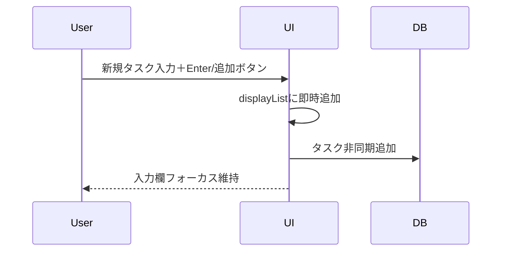

# TODOアプリ設計まとめ

## DBデータ構造

```sql
CREATE TABLE tasks (
  id INTEGER PRIMARY KEY AUTOINCREMENT,
  title TEXT NOT NULL,
  category TEXT CHECK(category IN ('緊急','重要','通常')),
  completed BOOLEAN DEFAULT 0,
  position INTEGER
);
```

- **id**: タスクの一意なID
- **title**: タスク内容
- **category**: 「緊急」「重要」「通常」
- **completed**: 完了状態
- **position**: 並び順（「通常」「重要」のみ使用。緊急は未使用）

**修正点:**  
- 「緊急」カテゴリのheaderはDBに保存しない。  
- DB初期化時は「通常」「重要」headerのみ作成。  
- 緊急headerはUIでのみ表示。

## 機能シーケンス（要点）

- タスク追加・削除・完了状態はUIキャッシュ（displayList）に即時反映、DBは非同期更新
- タスク追加時、入力欄はフォーカス維持で連続追加可能
- 入力欄左右キーでカテゴリ変更
- 緊急カテゴリはheaderプロパティで表示、childrenには含めない

## Mermaid記法シーケンス（例：タスク追加）



## 設計方針
- UIはdisplayList（キャッシュ）を参照
- DB更新は非同期
- 緊急headerはDBに保存せずUIでのみ表示
- すべての操作は即座にUI反映
- DBエラー時は通知

## データ保存設計

- データ保存先は `~/.local/share/<appname>/`
- SQLiteデータベースファイルはこのディレクトリ内に格納
