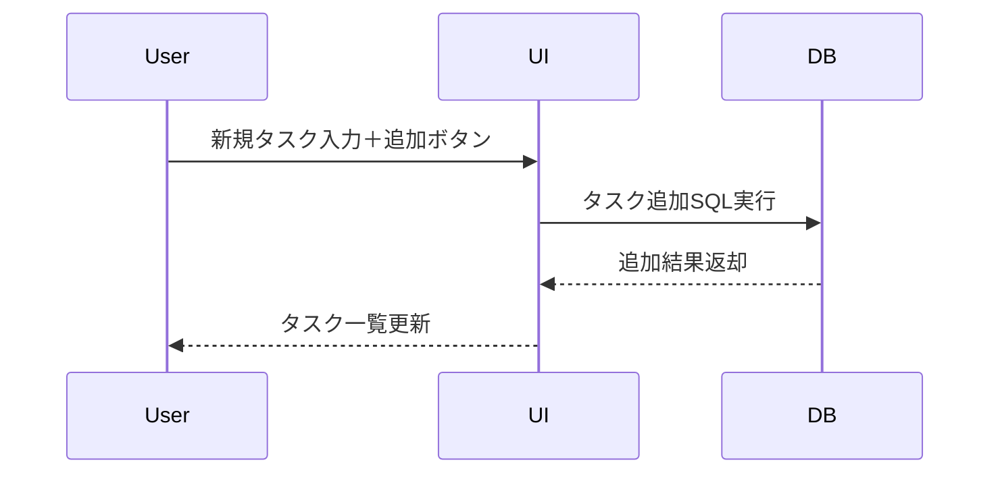
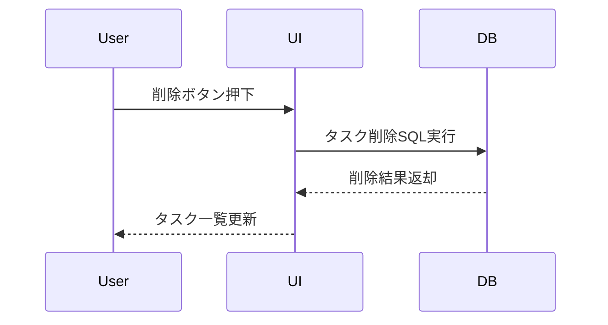
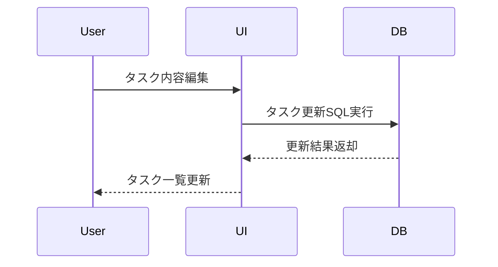
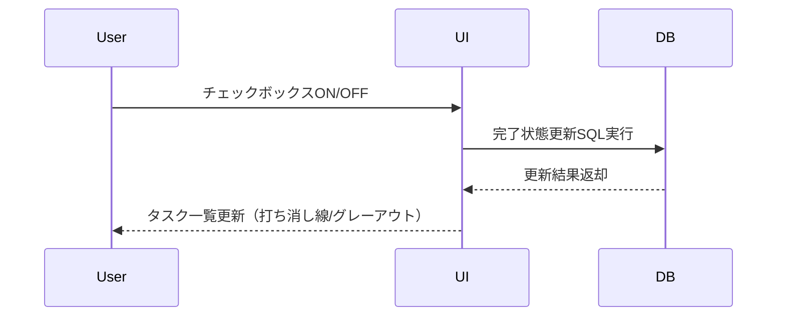

# TODOアプリ設計まとめ

## DBデータ構造提案

```sql
CREATE TABLE tasks (
  id INTEGER PRIMARY KEY AUTOINCREMENT, -- タスクID
  title TEXT NOT NULL,                 -- タスク内容
  category TEXT CHECK(category IN ('緊急','重要','通常')), -- カテゴリ
  completed BOOLEAN DEFAULT 0,         -- 完了フラグ
  position INTEGER                     -- 並び順
);
```

- **id**: タスクの一意なID（自動採番）
- **title**: タスク内容（必須）
- **category**: 「緊急」「重要」「通常」のいずれか
- **completed**: 完了状態（0:未完了, 1:完了）
- **position**: 表示順（ドラッグ＆ドロップで変更）

今後拡張する場合は、期限やメモ欄などのカラム追加も可能です。

## 機能シーケンス

### タスク追加


### タスク削除


### タスク編集


### タスク完了（チェック）


## 設計方針
- UI/DB分離
- すべての操作はDB永続化
- ユーザー操作は即座にUI反映
- DBエラー時は通知

## データ保存設計

- データの保存先は、Linuxデスクトップ標準のユーザーデータディレクトリ `~/.local/share/<appname>/` とする。
    - `<appname>` には本アプリの名称（例: `todo-widget` など）が入る。
    - SQLiteデータベースファイルや設定ファイル等はこのディレクトリ内に格納する。
    - 例: `~/.local/share/todo-widget/todo.db`
- この設計により、ユーザーごとにデータが分離され、他アプリとの干渉を防ぐ。
- バックアップや移行時も、当該ディレクトリをコピーすることで容易に対応可能。
