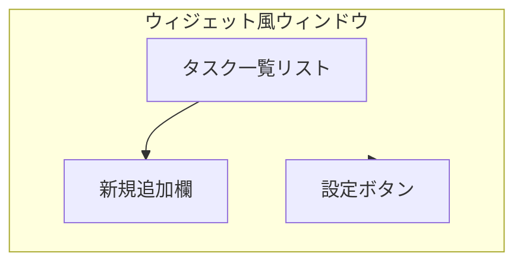

# TODOアプリ画面仕様

## 画面全体イメージ
- ウィジェット風の枠なしウィンドウ（常に前面表示可能、透明度調整）
- 縦長リスト表示（タスク一覧）
- 下部に新規追加欄

## 主要UIパーツ
- タスクリスト
    - 各行：チェックボックス／タスク内容テキスト／カテゴリラベル／削除ボタン
    - 完了時：打ち消し線＋グレーアウト
    - 並び替え：ドラッグ＆ドロップ可能
- 新規追加欄
    - テキスト入力／カテゴリ選択／追加ボタン
- その他
    - 設定ボタン（常に前面表示・透明度調整など）

## 画面レイアウト

## 状態遷移
- タスク追加：入力→追加→リスト更新
- タスク完了：チェック→状態変更→リスト更新
- タスク削除：削除→リスト更新
- 並び替え：ドラッグ→順序変更→リスト更新

## 備考
- 画面は最小限・シンプルに
- マウス操作中心（キーボードショートカットは任意）
- Ubuntu標準のUIガイドラインに準拠
